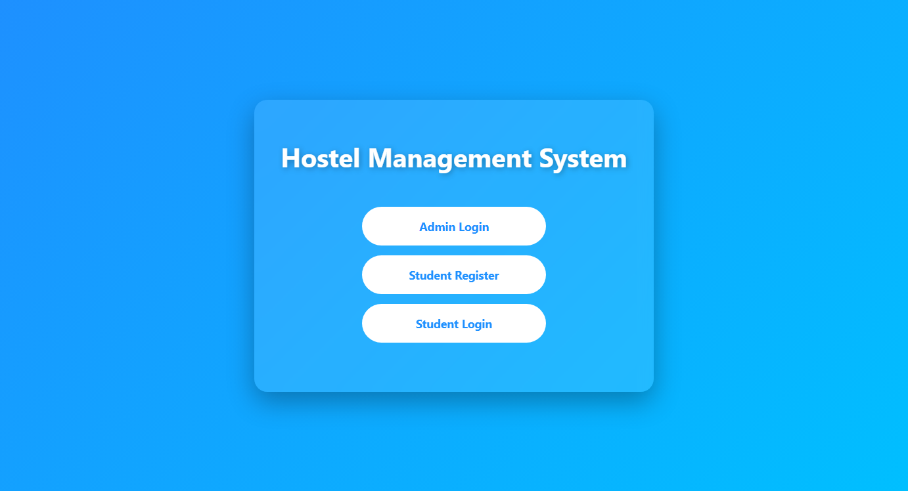
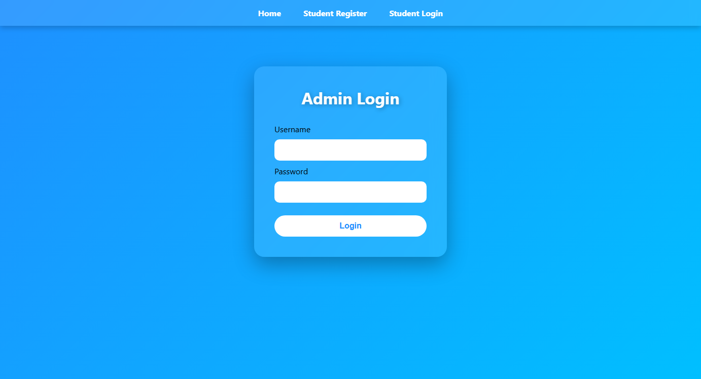
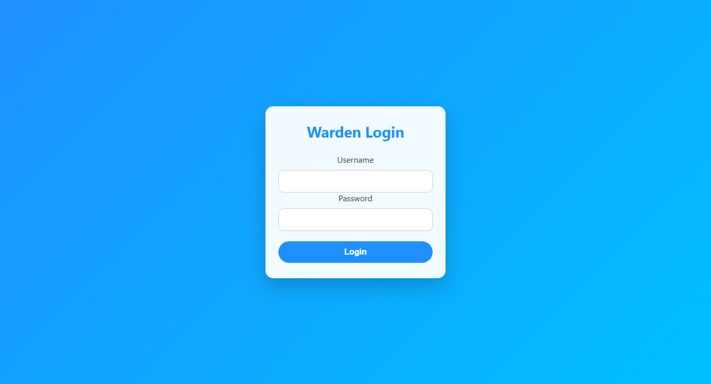
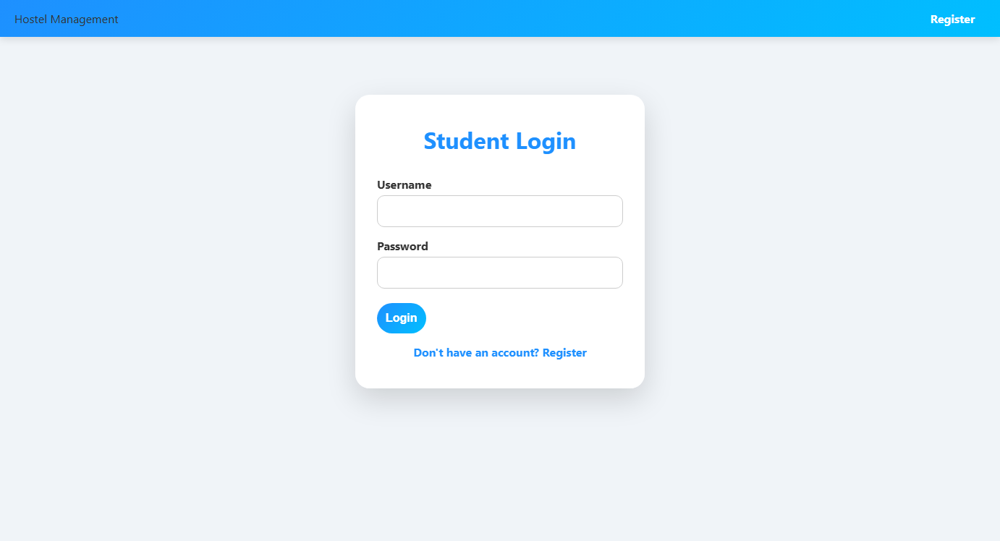
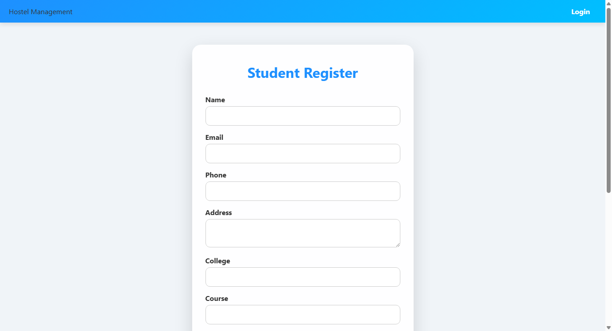
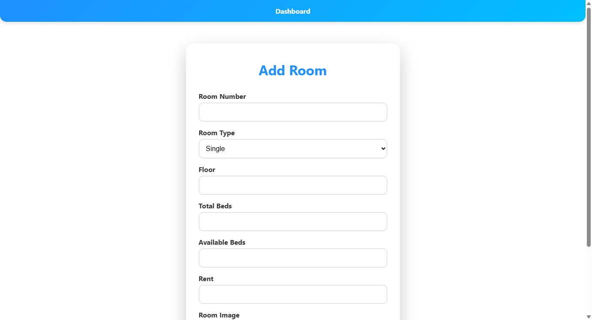
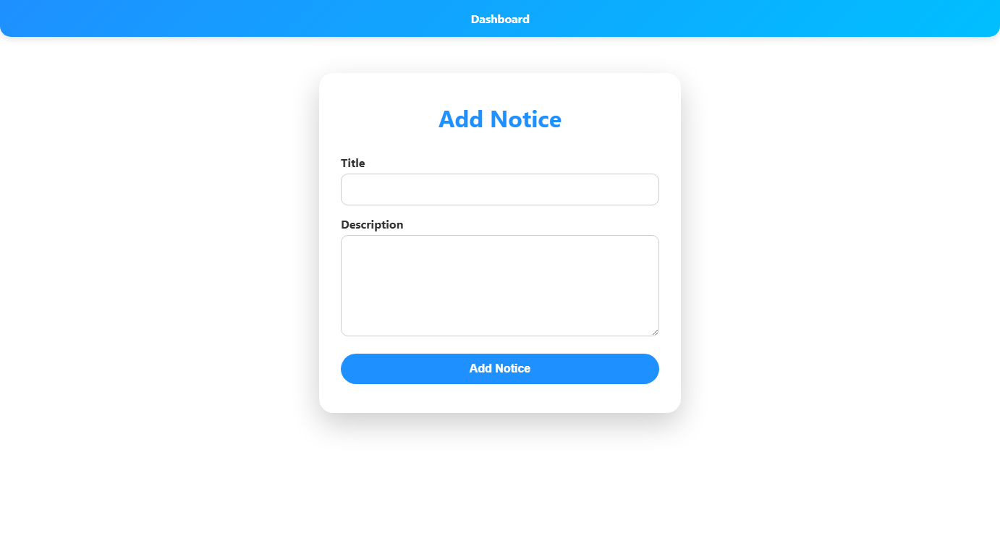

# 🏨 Hostel Management System

A full-featured **Django-based Hostel Management System** that streamlines hostel administration for students, wardens, and administrators. It covers room allocation, fee tracking, complaint management, notices, and multi-role authentication.

---

## 🌐 Live Repository

🔗 **[https://github.com/raghugs0319/Hostel_Management](https://github.com/raghugs0319/Hostel_Management)**

---

## 📸 Screenshots

### 🏠 Home Page


---

### 🔐 Admin Login


---

### 🔐 Warden Login


---

### 🎓 Student Login


---

### 📝 Student Registration


---

### 🛏️ Add Room


---

### 📢 Add Notice


---

## ✨ Features

### 👤 Multi-Role Authentication
| Role | Capabilities |
|------|-------------|
| **Admin** | Full system control — manage students, rooms, wardens, fees, complaints, notices |
| **Warden** | View students, manage complaints, post notices |
| **Student** | View own room, fees, complaints, notices |

---

### 🛏️ Room Management
- Add, edit, delete rooms
- Track room types: **Single / Double / Triple**
- Monitor **total beds** and **available beds** per room
- Set room **rent** per month
- Upload **room images**
- View **room members** (students in each room)
- Assign rooms to students

---

### 🎓 Student Management
- Register students with full profile:
  - Name, Email, Phone, Address
  - College Name, Course
  - Username & Password (for student login)
  - Photo upload
  - ID Proof upload
- View all students list
- Assign / reassign rooms
- View vacant (unassigned) students

---

### 👷 Warden Management
- Add wardens with credentials
- Warden photo upload
- View all wardens list
- Warden-specific dashboard

---

### 💰 Fee Management
- Add fee records per student per month
- Track fee **status**: `Paid` / `Pending`
- Record **payment date**
- Admin can view all fee records
- Students can view **their own fee history**

---

### 📢 Complaints System
- Students can **raise complaints** with title and description
- Admin/Warden can **view and resolve** complaints
- Status tracking: `Pending` / `Resolved`
- Date-stamped complaint records

---

### 📋 Notice Board
- Admin can **post notices** for students
- Students can view **all notices** from their dashboard
- Notice title and content management

---

## 🗂️ Project Structure

```
Hostel_Management/
│
├── hostel_management/          # Main Django project config
│   ├── settings.py             # Database, apps, static files config
│   ├── urls.py                 # Root URL routing
│   ├── wsgi.py
│   └── asgi.py
│
├── accounts/                   # Warden & Admin authentication
│   ├── models.py               # Warden model
│   ├── views.py                # Login/logout views
│   └── urls.py
│
├── students/                   # Student module
│   ├── models.py               # Student model
│   ├── views.py                # CRUD + login views
│   └── urls.py
│
├── rooms/                      # Room module
│   ├── models.py               # Room model
│   ├── views.py                # CRUD + assignment views
│   └── urls.py
│
├── fees/                       # Fee management
│   ├── models.py               # Fee model
│   ├── views.py                # Fee CRUD views
│   └── urls.py
│
├── complaints/                 # Complaints module
│   ├── models.py               # Complaint model
│   ├── views.py                # Complaint views
│   └── urls.py
│
├── notice/                     # Notice board
│   ├── models.py               # Notice model
│   ├── views.py                # Notice views
│   └── urls.py
│
├── templates/                  # All HTML templates (27 files)
│   ├── home.html
│   ├── admin_login.html
│   ├── admin_dashboard.html
│   ├── student_login.html
│   ├── student_dashboard.html
│   ├── student_register.html
│   ├── warden_login.html
│   ├── warden_dashboard.html
│   ├── add_room.html / view_rooms.html / assign_room.html
│   ├── add_student.html / view_students.html
│   ├── add_fee.html / view_fees.html
│   ├── add_complaint.html / view_complaints.html
│   ├── add_notice.html / view_notice.html
│   └── ...
│
├── static/                     # CSS, JS, Images
├── media/                      # Uploaded files (photos, id proofs)
├── manage.py
└── README.md
```

---

## 🗃️ Database Models

### Student
| Field | Type | Description |
|-------|------|-------------|
| name | CharField | Full name |
| email | EmailField | Email address |
| phone | CharField | Phone number |
| address | TextField | Full address |
| college | CharField | College name |
| course | CharField | Course enrolled |
| username | CharField | Login username |
| password | CharField | Login password |
| photo | ImageField | Student photo |
| id_proof | FileField | ID proof document |
| joining_date | DateField | Auto-set on creation |
| room | ForeignKey(Room) | Assigned room |

### Room
| Field | Type | Description |
|-------|------|-------------|
| room_number | CharField | Room identifier |
| room_type | CharField | Single / Double / Triple |
| floor | IntegerField | Floor number |
| total_beds | IntegerField | Total capacity |
| available_beds | IntegerField | Currently available |
| rent | IntegerField | Monthly rent (₹) |
| room_image | ImageField | Room photo |

### Warden
| Field | Type | Description |
|-------|------|-------------|
| name | CharField | Full name |
| email | EmailField | Email |
| phone | CharField | Phone number |
| username | CharField | Login username |
| password | CharField | Login password |
| photo | ImageField | Warden photo |

### Fee
| Field | Type | Description |
|-------|------|-------------|
| student | ForeignKey(Student) | Associated student |
| month | CharField | Fee month |
| amount | IntegerField | Fee amount (₹) |
| status | CharField | Paid / Pending |
| payment_date | DateField | Date of payment |

### Complaint
| Field | Type | Description |
|-------|------|-------------|
| student | ForeignKey(Student) | Complaint raised by |
| title | CharField | Complaint title |
| description | TextField | Full description |
| status | CharField | Pending / Resolved |
| date | DateField | Auto-set on creation |

---

## 🛠️ Tech Stack

| Technology | Usage |
|------------|-------|
| **Python 3.x** | Backend language |
| **Django 5.2** | Web framework |
| **MySQL** | Database |
| **HTML5 / CSS3** | Frontend templates |
| **Bootstrap** | UI styling |
| **Django ORM** | Database abstraction |

---

## ⚙️ Installation & Setup

### Prerequisites
- Python 3.8+
- MySQL Server
- pip

### 1. Clone the Repository
```bash
git clone https://github.com/raghugs0319/Hostel_Management.git
cd Hostel_Management
```

### 2. Create Virtual Environment
```bash
python -m venv venv
# Windows
venv\Scripts\activate
# Linux/Mac
source venv/bin/activate
```

### 3. Install Dependencies
```bash
pip install django mysqlclient pillow
```

### 4. Configure Database
Create a MySQL database named `hostel_db`:
```sql
CREATE DATABASE hostel_db;
```

Update `hostel_management/settings.py`:
```python
DATABASES = {
    'default': {
        'ENGINE': 'django.db.backends.mysql',
        'NAME': 'hostel_db',
        'USER': 'your_mysql_username',
        'PASSWORD': 'your_mysql_password',
        'HOST': 'localhost',
        'PORT': '3306',
    }
}
```

### 5. Run Migrations
```bash
python manage.py makemigrations
python manage.py migrate
```

### 6. Create Superuser (Admin)
```bash
python manage.py createsuperuser
```

### 7. Run the Server
```bash
python manage.py runserver
```

🌐 Open your browser and go to: **http://127.0.0.1:8000**

---

## 🔗 URL Routes

| URL | Description |
|-----|-------------|
| `/` | Home page |
| `/admin-login/` | Admin login |
| `/admin-dashboard/` | Admin dashboard |
| `/warden-login/` | Warden login |
| `/warden-dashboard/` | Warden dashboard |
| `/student-login/` | Student login |
| `/student-register/` | Student registration |
| `/student-dashboard/` | Student dashboard |
| `/rooms/` | View all rooms |
| `/rooms/add/` | Add new room |
| `/rooms/assign/` | Assign room to student |
| `/students/` | View all students |
| `/students/add/` | Add new student |
| `/fees/` | View all fees |
| `/fees/add/` | Add fee record |
| `/complaints/` | View all complaints |
| `/complaints/add/` | Add complaint |
| `/notice/` | View notices |
| `/notice/add/` | Post new notice |
| `/admin/` | Django admin panel |

---

## 👥 User Roles & Access

```
Admin
  ├── Login via /admin-login/
  ├── Manage Wardens (Add / View)
  ├── Manage Students (Add / View / Assign Room)
  ├── Manage Rooms (Add / View / Room Members)
  ├── Manage Fees (Add / View / Update Status)
  ├── View & Resolve Complaints
  └── Post & View Notices

Warden
  ├── Login via /warden-login/
  ├── View Students
  ├── View & Resolve Complaints
  └── Post & View Notices

Student
  ├── Register via /student-register/
  ├── Login via /student-login/
  ├── View My Room Details
  ├── View My Fee Records
  ├── Raise & View Complaints
  └── View Notices
```

---

## 🚀 Future Enhancements

- [ ] Online fee payment integration (Razorpay / Stripe)
- [ ] Email notifications for fee due & complaint updates
- [ ] PDF fee receipt generation
- [ ] QR code-based student ID cards
- [ ] Visitor management module
- [ ] Leave application system for students
- [ ] Mobile-responsive UI improvements
- [ ] REST API with Django REST Framework

---

## 🤝 Contributing

1. Fork the repository
2. Create your feature branch: `git checkout -b feature/AmazingFeature`
3. Commit your changes: `git commit -m 'Add some AmazingFeature'`
4. Push to the branch: `git push origin feature/AmazingFeature`
5. Open a Pull Request

---

## 📄 License

This project is open source and available under the [MIT License](LICENSE).

---

## 👨‍💻 Author

**raghugs0319**  
🔗 GitHub: [https://github.com/raghugs0319](https://github.com/raghugs0319)

---

⭐ **If you found this project helpful, please give it a star!** ⭐
